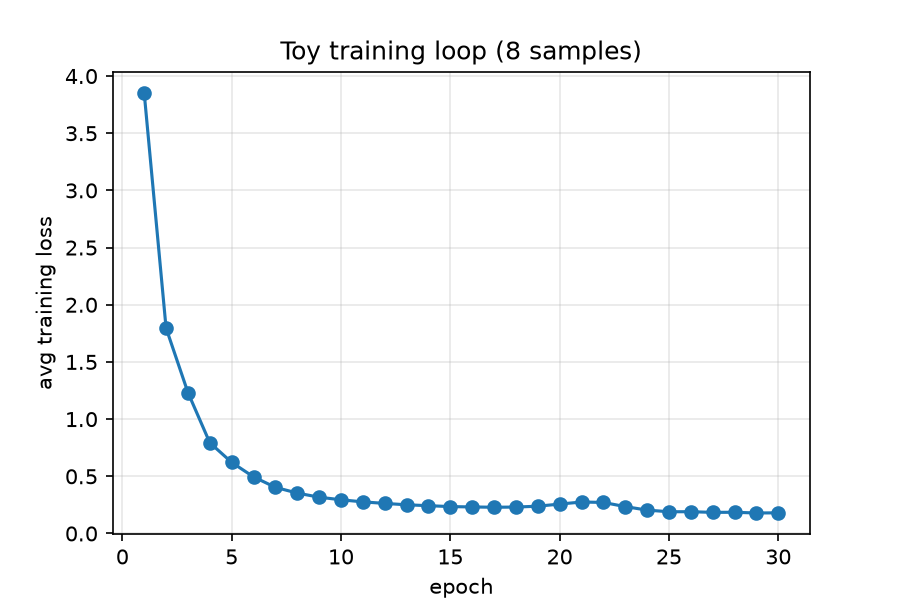
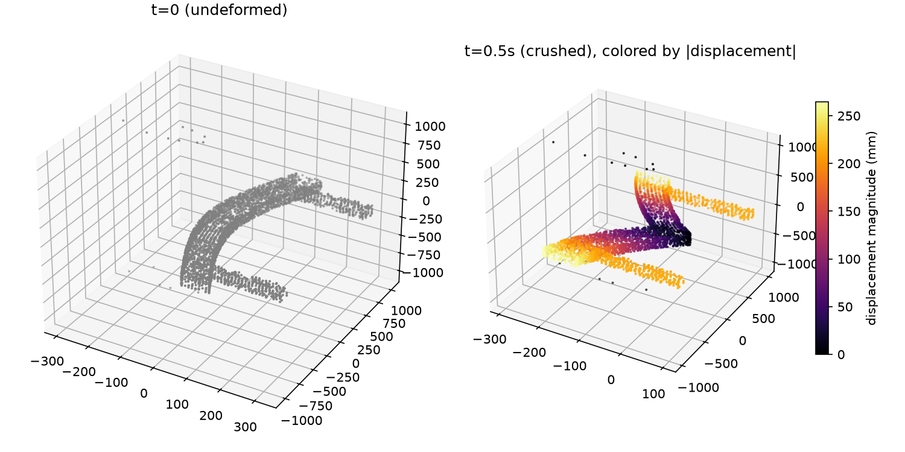

# Surrogate by Example: Training and Inference

A guided walkthrough of training a bumper-crash surrogate and using a pretrained model on AMD
GPUs. The example has two parts: a small training exercise that plots loss as epochs increase,
then a real checkpoint that reports model size, inference speed, and error against two simulations.

| Part | What it shows | Outputs |
|---|---|---|
| Toy training | Eight simulation runs, a short training loop, and loss over epochs | Training-loss CSV and plot |
| Real-model inference | Load the supplied checkpoint; measure size and speed; compare run19 and run201 | Size in GB, inference timings, and reference/prediction errors |

Start with `workshop_crash_surrogate.py` for a batch run with saved artifacts, or open
`workshop_crash_surrogate.ipynb` for the interactive walkthrough. The toy loop performs real
optimization on a small dataset to demonstrate training. It does not reproduce the production
training run. Loss should trend downward with training, but it need not fall at every epoch.

## The application

The model predicts bumper crash response from a mesh, impact velocity, independent crash-box and
beam thickness scales, and wall position. The GeoTransolver one-shot model with GALE attention
predicts 50 frames after the initial state, including positions, plastic strain, and von Mises stress.
Each input simulation contains 51 frames and roughly 14,000 mesh nodes.

Part 1 trains on eight bundled runs for 30 epochs by default. Part 2 loads a separate supplied
200-epoch checkpoint from the larger 225-run project, together with its original normalization
statistics. The full production training dataset is not included. The two evaluation cases are
`run19` and `run201`.

Continue with [design optimization](../02_design_optimization/) to reuse this checkpoint
for a two-parameter constrained search with automatic differentiation.

## Folder layout

```text
01_training_and_inference/
├── README.md
├── workshop_crash_surrogate.py
├── workshop_crash_surrogate.ipynb
├── environment/       # installers and container recipes
├── data/              # eight training runs, two holdouts, global features
├── checkpoint/        # supplied weights, statistics, and YAML configurations
├── src/               # model, data pipeline, loss, and measurement helpers
├── results/           # generated runs (created when running the example)
├── reported_results/  # small artifacts copied from a run for durable in-repo linking
└── TESTING.md         # historical system checks and troubleshooting
```

## Setup and run

Run these commands from `MLExamples/physics_nemo/01_training_and_inference`. The ROCm 10 installer
targets gfx942 (MI300A/MI300X), Python 3.12, PyTorch 2.11.0, and PhysicsNeMo 2.1.1. Review the
installer for another GPU or software stack. See [TESTING.md](TESTING.md) for environment variants
and historical compatibility checks.

```bash
cd environment
apptainer pull workshop_base_rocm10.sif docker://rocm/dev-ubuntu-22.04:10.0.0-full
apptainer exec --bind "$(pwd)/..:/workshop" workshop_base_rocm10.sif \
  bash /workshop/environment/setup_env_rocm10.sh
cd ..
```

On an allocated GPU node:

```bash
mkdir -p results
set -o pipefail
apptainer exec --rocm --bind "$(pwd):/workshop" --pwd /workshop \
  --env FORCE_ADAM_MI300A=1 \
  --env RANK=0 --env WORLD_SIZE=1 --env LOCAL_RANK=0 \
  --env MASTER_ADDR=127.0.0.1 --env MASTER_PORT=29500 \
  environment/workshop_base_rocm10.sif \
  /workshop/environment/venv_rocm10/bin/python3 -u workshop_crash_surrogate.py \
  --epochs 30 --warmup 3 --repeats 10 \
  --output-dir results/first_run 2>&1 | tee results/first_run.log
```

`FORCE_ADAM_MI300A=1` selects Adam for the toy loop; omit it to exercise the configured Muon
optimizer. The other environment variables establish a single-process checkpoint-loading context
under Slurm. With a prepared Python environment, use:

```bash
python3 workshop_crash_surrogate.py --epochs 30 --warmup 3 --repeats 10
```

The script creates a timestamped results directory by default. An explicit `--output-dir` must be
new. `--help` works without the ML dependencies. Launch Jupyter from this application folder for
the notebook. Its timings and size measurements appear inline; use the script for artifact exports.

## Configuration

| Setting | Purpose |
|---|---|
| `checkpoint/toy_config.yaml` | Toy model, eight-run dataset, learning rate, loss, and default epochs |
| `--epochs` | Override the toy epoch count and inspect the resulting loss curve |
| `checkpoint/config.yaml` | Architecture and evaluation data paths for the supplied checkpoint |
| `checkpoint/stats/` | Original normalization required by that checkpoint |
| `--warmup`, `--repeats` | Warmup and timed forwards per held-out simulation; defaults 3 and 10 |
| `environment/setup_env_rocm10.sh` | Software versions and GPU architecture |

The evaluation config retains production training settings but points to the bundled holdouts. It
cannot reproduce the full training run by itself. The ROCm radius-search patch is loaded before
model construction. See [TESTING.md](TESTING.md) for its background.

## Results and artifacts

The loss curve illustrates the training process. The final measurements use the independently
loaded real checkpoint:

- **Model size:** saved `.mdlus` archive size in decimal GB (`bytes / 1e9`), excluding optimizer
  state. Parameter and buffer memory is reported separately; it excludes activations and allocator
  overhead, so it is not peak GPU memory.
- **Inference speed:** median, minimum, and maximum forward-pass time per simulation after warmup,
  plus full trajectories per second. Each forward predicts all 50 output frames. CUDA/HIP work is
  synchronized around every timed call. Disk reads, preprocessing, host-to-device transfers, model
  loading, and error calculations are outside this measurement.
- **Error against two simulations:** predicted and reference maxima for displacement magnitude,
  plastic strain, and stress, with `100 * abs(prediction - reference) / reference` for each run.
  Displacement is measured in mm and maximized over nodes and times. It is not a directional
  intrusion measurement at a selected location. Stress and strain use the existing channel
  representation; confirm dataset units/scaling before labeling stress as MPa.

### Saved artifacts

The Python walkthrough creates one directory per run. Generated files are ignored by Git; keep
reports and selected figures deliberately when publishing measurements. `first_run.log` in the
README command is captured by the shell beside the run directory.

| File inside a run | Contents |
|---|---|
| `run.json` | Start time, software/device information, selected optimizer, checkpoint epoch, model archive and parameter/buffer sizes in decimal GB, training and total wall times; `status: complete` only after successful evaluation |
| `toy_config.yaml` | Resolved toy configuration, including that run's normalization directory |
| `evaluation_config.yaml` | Resolved configuration for the supplied checkpoint |
| `mesh.png` | Reference undeformed and final deformed mesh |
| `training_loss.csv`, `training_loss.png` | Average training loss per epoch; illustrative, not validation accuracy |
| `inference_timing.json` | Per-case warmup/repetition counts, raw durations, median/min/max latency, and full trajectories per second; synchronized forwards with inputs already on device |
| `evaluation.csv` | Predicted/reference maxima and relative errors for displacement, plastic strain, and stress on run19 and run201 |
| `toy_stats/*.json` | Normalization computed from the eight toy training samples |
| `vtp/run19/frame_*.vtp`, `vtp/run201/frame_*.vtp` | Reference positions exported by the reader, not predicted fields |

A failed run can leave partial artifacts. Check the exit code and `run.json` completion status
before using a run in a report. Early dependency failures may leave only an empty directory.
Configuration paths are resolved for the source application; copy the application inputs as well
as the result directory when transferring a reproducible experiment.

Stress and strain maxima currently use the model/datapipe channel representation, as in the original
walkthrough. Do not label stress columns as MPa without confirming the dataset units and scaling.
The percentages compare prediction and reference in that same representation.

The notebook writes its reference frames and toy statistics under `results/notebook/` and displays
its plots inline. It does not produce the script's CSV files or completion metadata.

### Recording results on another system

Status: measured 2026-09-28, run `first_run` (see [Configuration and provenance](#configuration-and-provenance)).

#### Replacing Pending with measured values

The script writes the measurements to the run directory; it does not edit this README automatically.
After a run, you or an agent can update this section using the following procedure:

1. Select one run directory, such as `results/first_run/`. Check that its `run.json` has
   `status: complete` and that both `run19` and `run201` occur in `inference_timing.json` and
   `evaluation.csv`. Use all measurements from that same run.
2. Replace the Pending cells using the exact fields in the table below. The timing JSON is a list
   of records: select each by its `run` field. Values already use the stated units; do not convert
   milliseconds again. Report sizes to six decimal places and timings to three, keeping the raw files.
3. Fill in configuration and provenance from `run.json`, the resolved YAML files, and the launch log.
   Obtain missing host/allocation/container details from the target system. Leave unavailable fields
   marked as unrecorded rather than inferring them from the setup recipe.
4. Populate the error table from `evaluation.csv`. Describe the actual loss trend from
   `training_loss.csv`, and embed the saved `training_loss.png` and `mesh.png` with relative links.
5. Keep the supporting JSON, CSV, YAML, log, and figures at a durable location and link them here.
   Local `results/` directories are ignored by Git: for a report shared in this repository, copy the
   selected small artifacts into `reported_results/<run-id>/` and link to those copies. VTP frames
   can remain in external storage. Record the location rather than adding broken local links.
6. Change the status above to measured, including the date and run identifier. Keep the historical
   measurements in “Where the numbers come from” labeled separately from the new results.

For example, ask an agent:

> Update the results section of this README from `results/first_run/`. Verify completion, fill in
> model size, per-case inference timings and errors using the documented fields, and record the
> environment and command. Copy the supporting small artifacts into `reported_results/first_run/`
> and embed the loss and mesh plots. Report missing information explicitly; preserve the historical
> results as a separate comparison.

#### Configuration and provenance

- Date, repository commit, and local changes: 2026-09-28, commit `a4107ebd1e8202ec114cf74661906a2ecebf3a49`, clean working tree.
- Host, GPU, CPU, memory, and scheduler allocation: Slurm node `ppac-pl1-s24-26`, partition `PPAC_MI300A_SPX` (192 CPUs, 514000 MB RAM, 4x GPU per node); job allocated with `--gpus=1`. Device reported by PyTorch: 1x AMD Instinct MI300A.
- Container image/digest, driver, ROCm, Python, PyTorch, PhysicsNeMo: `environment/workshop_base_rocm10.sif` (built from `docker://rocm/dev-ubuntu-22.04:10.0.0-full`), ROCm `7.15.26333`, Python `3.12.14`, PyTorch `2.11.0+rocm10.0.0`, PhysicsNeMo `2.1.1`, PyVista `0.49.0`.
- Exact command, environment overrides, optimizer, and epoch count:

  ```bash
  apptainer exec --rocm --bind "$(pwd):/workshop" --pwd /workshop \
    --env FORCE_ADAM_MI300A=1 \
    --env RANK=0 --env WORLD_SIZE=1 --env LOCAL_RANK=0 \
    --env MASTER_ADDR=127.0.0.1 --env MASTER_PORT=29500 \
    environment/workshop_base_rocm10.sif \
    /workshop/environment/venv_rocm10/bin/python3 -u workshop_crash_surrogate.py \
    --epochs 30 --warmup 3 --repeats 10 \
    --output-dir results/first_run
  ```

  `FORCE_ADAM_MI300A=1` was set, so the toy loop used Adam rather than the configured Muon optimizer
  (Muon's Newton-Schulz bf16 GEMMs hit a known hipBLASLt/MI300A-228CU tuning gap; see
  [ROCm/rocm-systems#4084](https://github.com/ROCm/rocm-systems/issues/4084)). Toy epochs: 30.
- Dataset/checkpoint identifiers and normalization files: supplied checkpoint
  `checkpoint/checkpoints/checkpoint.0.200.pt` / `GeoTransolverOneShot.0.200.mdlus` (epoch 200,
  experiment `Bumper-GeoFLARE-2D-Thickness`), normalized with `checkpoint/stats/*.json`. Toy training
  used the bundled `data/vtp_train` (8 runs) with normalization recomputed into `toy_stats/*.json`.
  Evaluation held out `run19` and `run201` from `data/vtp_holdout`.
- Run directory and console log: `results/first_run/` (small artifacts copied to
  [`reported_results/first_run/`](reported_results/first_run/)); console log
  [`reported_results/first_run/first_run.log`](reported_results/first_run/first_run.log).

#### Toy training

See [`training_loss.csv`](reported_results/first_run/training_loss.csv) and
[`training_loss.png`](reported_results/first_run/training_loss.png).



Loss dropped sharply for the first ~10 epochs (3.85 → 0.29), then declined more gradually with two
mild bumps around epochs 19–22 (0.24 → 0.28) before resuming its downward trend, ending at 0.181
after 30 epochs. This matches the README's expectation that loss need not fall monotonically every
epoch. This is an eight-run mechanics demonstration; the final inference below uses the separate
200-epoch checkpoint, not this toy model.

Reference mesh used for both parts:



#### Real model size and inference speed

| Measurement | Value | Source |
|---|---|---|
| Model archive size, decimal GB | 0.027182 | `run.json`: `model_archive_gb` |
| Parameters and buffers, decimal GB | 0.027112 | `run.json`: `model_tensor_gb` |
| run19 median/min/max latency, ms | 109.828 / 108.770 / 110.324 | `inference_timing.json`, `run: run19`: `median_inference_ms` / `min_inference_ms` / `max_inference_ms` |
| run201 median/min/max latency, ms | 109.522 / 108.661 / 110.715 | `inference_timing.json`, `run: run201`: same three fields |
| run19 full trajectories per second | 9.105 | `inference_timing.json`, `run: run19`: `trajectories_per_second` |
| run201 full trajectories per second | 9.131 | `inference_timing.json`, `run: run201`: `trajectories_per_second` |
| Warmup and repetition counts, per case | 3 warmups, 10 repeats (both cases) | `inference_timing.json`: `warmup` / `repeats` |

Timing covers synchronized forward passes with inputs already on device. It excludes model loading,
preprocessing, input transfers, and metric calculation. Archive size excludes optimizer state;
parameter/buffer size is not peak GPU memory. Full data:
[`inference_timing.json`](reported_results/first_run/inference_timing.json).

#### Error against simulations

Full data: [`evaluation.csv`](reported_results/first_run/evaluation.csv). Displacement is peak
magnitude in mm over all nodes and times; strain and stress use the model/datapipe channel
representation (see caveat below). Each relative error is
`100 * abs(prediction - reference) / reference`. These measurements match the historical values in
[Where the numbers come from](#where-the-numbers-come-from), since the same checkpoint and holdout
simulations are used.

| Simulation | Peak displacement error (%) | Peak strain error (%) | Peak stress error (%) |
|---|---:|---:|---:|
| run19 | 0.57 | 0.75 | 11.59 |
| run201 | 0.26 | 6.49 | 12.55 |

Select rows by `run` in `evaluation.csv`. The corresponding columns are
`displacement_relative_error_pct`, `strain_relative_error_pct`, and `stress_relative_error_pct`.
These values are already percentages.

## Where the numbers come from

Size and timing are measured by the script on the system where it runs. No new GPU timings were
measured during this restructuring. Historical checkpoint checks in [TESTING.md](TESTING.md)
recorded the following on MI300A with ROCm 10 and PyTorch 2.11:

| Simulation | Peak displacement error | Peak strain error | Peak stress error |
|---|---:|---:|---:|
| run19 | 0.57% | 0.75% | 11.59% |
| run201 | 0.26% | 6.49% | 12.55% |

Re-measure these on the target system. Two simulation cases do not establish accuracy across the
whole design space. The walkthrough does not measure FEA runtime or claim a speedup over the solver.
