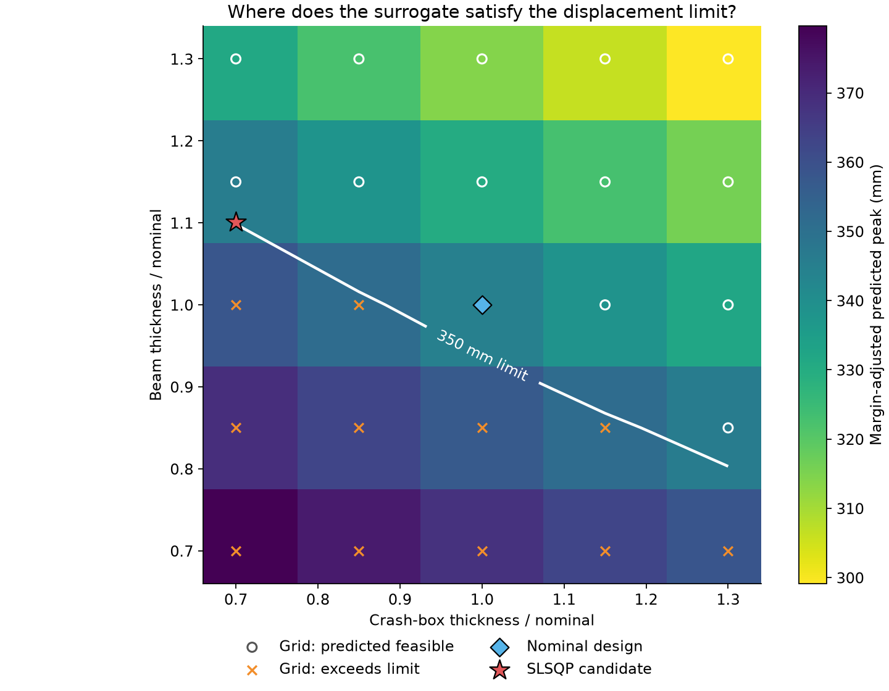
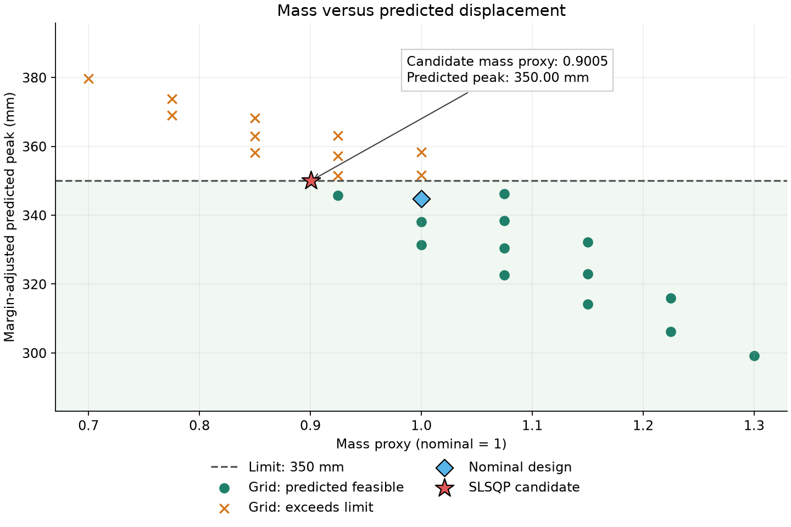

# Bumper design optimization with automatic differentiation

How should we distribute material between the crash boxes and bumper beam to reduce
mass while limiting crash deformation? This example searches two independent thickness
scales using the pretrained model supplied in [application 01](../01_training_and_inference/).
It loads that checkpoint once, evaluates a coarse design grid, and refines a candidate
using a constrained optimizer supplied with derivatives from PyTorch autograd.

No training or additional checkpoint download is needed. The script uses the sibling
application's model code, mesh, configuration, and original normalization statistics.
The checkpoint is the 200-epoch GeoTransolverOneShot model from the 225-run project,
with displacement, plastic strain, and stress outputs; this objective uses displacement.

## Run

Create the environment once using the [shared setup](../README.md#shared-environment)
in the parent `physics_nemo` directory. It includes SciPy and uses the prebuilt
ROCm 10 PyTorch container. Both exercises use the same home-directory environment.

Inside that container on an allocated GPU node, start from
`MLExamples/physics_nemo/02_design_optimization`:

```bash
export RANK=0 WORLD_SIZE=1 LOCAL_RANK=0
export MASTER_ADDR=127.0.0.1 MASTER_PORT=29500
mkdir -p results
set -o pipefail
"$HOME/venvs/physicsnemo-rocm10/bin/python3" -u optimize.py \
  --limit-mm 350 --output-dir results/first_run 2>&1 | tee results/first_run.log
```

The output directory must be new. Use another name for each run, such as
`results/mi300a_run2`. The script prints its absolute location at startup and saves:

```text
results/first_run/
├── result.json              # candidate, gradients, feasibility, software, checkpoint hash
├── grid.csv                 # evaluated thickness pairs and predictions
├── checkpoint_config.yaml   # resolved model configuration
├── design_space.png         # thickness grid, displacement limit, candidate
└── mass_displacement.png    # mass versus displacement comparison
```

If `--output-dir` is omitted, a timestamped directory is created under this exercise's
`results/` folder. An explicit relative path is resolved from the directory where you
launch the command.

No activation or `PYTHONPATH` setting is needed. The environment persists in your home
directory and must be used inside the same image. CPU execution is supported but may
be slow. Launch one process with one GPU; use a distinct master port for concurrent runs.
`python3 optimize.py --help` works without importing the ML dependencies.

Defaults: impact velocity `-7`, wall position `0`, 5 × 5 grid, 40 maximum SLSQP
iterations, and thickness bounds `[0.7, 1.3]`. Change `--velocity` within `[-7,-3]`
and `--wall-position` within `[0,240]` to explore other loads. Each invocation fixes
one load case; it does not enforce constraints across all possible impacts.
The 350 mm default is an illustrative surrogate constraint, not an engineering standard.

## Results and artifacts

Like exercise 1, the script writes numerical results and figures to `results/<run-id>/`.
Generated runs are ignored by Git. The shell command captures the console log beside
the run directory. The script does not edit this README automatically; publish selected
small artifacts under `reported_results/<run-id>/` when reporting a run.

### Recording results on another system

After a run, you or an agent can update this section using the same procedure as exercise 1:

1. Select one run directory, such as `results/first_run/`. Check the process exit code,
   `status: complete` in `result.json`, and the presence of the CSV, configuration, and plots.
   Report `solver_success` and `candidate.predicted_feasible` separately: completion does
   not imply a successful search or a physically validated design.
2. Fill the result table using the exact JSON fields below. Describe the finite-difference
   comparison using `nominal_gradient` and `gradient_checks` from that same run.
3. Record the date, repository commit, software, device, load case, displacement limit,
   safety factor, and launch command. Obtain missing host, allocation, and container
   details from the target system; mark unavailable details as unrecorded.
4. Copy that run's small JSON, CSV, YAML, PNG files and console log into
   `reported_results/<run-id>/`. Embed its `design_space.png` and `mass_displacement.png`
   with relative links. Do not combine one run's figures with another run's measurements.
5. Update the status, captions, and provenance to describe the selected run. Retain earlier
   measurements as a clearly labeled historical comparison if useful.

For example, ask an agent:

> Update this README from `results/first_run/`. Verify completion and report optimizer
> success, predicted feasibility, the thickness pair, mass proxy, peak displacement,
> constraint violation, and gradient checks. Copy the supporting artifacts and log into
> `reported_results/first_run/`, embed the saved plots, and record configuration and
> provenance. Report missing information explicitly and preserve earlier results as a
> separate comparison. Do not label the candidate FEA-validated without solver evidence.

### Reported reference run

Status: measured 2026-09-30, run `reference_run`. These are the earlier cluster measurements,
not a report of a later user run. Supporting files are in
[`reported_results/reference_run/`](reported_results/reference_run/).

| Quantity | Result | Field in `result.json` |
|---|---:|---|
| Nominal predicted peak | 344.817 mm | `nominal_peak_mm` |
| Crash-box thickness scale | 0.700000 | `candidate.crash_box` |
| Beam thickness scale | 1.100974 | `candidate.beam` |
| Mass proxy | 0.900487 | `candidate.mass_proxy` |
| Margin-adjusted peak | 350.000 mm | `candidate.adjusted_peak_mm` |
| Constraint violation | 0.000 mm | `candidate.violation_mm` |
| Optimizer success | true | `solver_success` |
| Predicted feasible | true | `candidate.predicted_feasible` |
| FEA validated | false | `fea_validated` |

These plots use the [saved reference run](reported_results/reference_run/result.json) and its
[25-point grid](reported_results/reference_run/grid.csv), with a 350 mm limit and a safety factor of one.
They are generated from recorded surrogate predictions; no additional FEA was run.
New optimization runs generate the same plots using their own results.



Circles mark predicted-feasible grid points; crosses exceed the displacement limit.
The white line interpolates the coarse grid at 350 mm, so it is only a visual guide.
The red star is the candidate evaluated directly by the model: crash-box scale **0.700**
and beam scale **1.101**. A small difference between the star and interpolated line
is expected with this coarse grid. The plot does not establish a global optimum.



Lower mass lies to the left; predictions below the dashed limit satisfy the surrogate
constraint. The candidate has mass proxy **0.9005**, about **9.95% below nominal**, with
predicted peak displacement **350.0 mm**. Different material distributions can have
the same mass proxy but different displacement predictions. Physical mass savings
and crash safety still require independent engineering validation.

#### Configuration and provenance

- Measured 2026-09-30 on one GPU in the `MI355x` partition; the runtime reports
  `AMD Radeon Graphics`. Host name and container digest were not recorded.
- PyTorch `2.9.1+rocm7.2.1.gitff65f5bc`, PhysicsNeMo `2.1.1`, SciPy `1.18.0`.
  This used the existing cluster environment, not the later shared ROCm 10 installer.
- Epoch 200 checkpoint; exact SHA256 is in `result.json`. Load: velocity `-7`, wall
  position `0`; displacement limit `350 mm`; safety factor `1`; grid `5 × 5`;
  maximum SLSQP iterations `40`. The returned solution took three iterations.
- The original output directory was named `sample_results`; files were subsequently
  moved here for reporting. Its absolute path remains in the JSON as original provenance.
  Plots were generated afterward from those saved files. The raw launch log and exact
  source commit were not retained alongside this run.
- Numerical gradient comparison and unsuccessful-search checks are documented in
  [VALIDATION.md](VALIDATION.md).

To generate plots from an earlier run without loading the model or using a GPU:

```bash
"$HOME/venvs/physicsnemo-rocm10/bin/python3" plot_results.py results/first_run
```

This writes or replaces the two PNG files and preserves the saved numerical results.

## Mathematical problem

Let the dimensionless design vector be

$$
x=(x_c,x_b),\qquad 0.7\leq x_c,x_b\leq1.3,
$$

where `1` is nominal thickness, `c` denotes crash boxes, and `b` denotes the beam.
With fixed mesh and impact conditions, the trained network predicts normalized
positions $\hat p_{it}(x)$ for each node $i$ and future frame $t$.
Using the checkpoint's coordinate standard deviations $\sigma_p$, recover displacement:

$$
u_{it}(x)=(\hat p_{it}(x)-p_{i0})\odot\sigma_p,
\qquad D(x)=\max_{i,t}\|u_{it}(x)\|_2.
$$

The coordinate mean cancels in the subtraction. The result is in the mesh's length
units, millimetres. Here “peak intrusion” means maximum nodal displacement magnitude
over the predicted trajectory; it is not displacement at a particular occupant location
or along a specified intrusion axis.

We solve

$$
\min_x m(x)=\tfrac12 x_c+\tfrac12 x_b
\quad\text{subject to}\quad sD(x)\leq D_{\rm limit}.
$$

The mass proxy assumes equal nominal mass contributions from the two zones. It is
normalized to one at the nominal design. A value of `0.90` means a 10% reduction in
this proxy; actual mass requires material densities, element areas, and zone thicknesses.
Replace the equal weights with measured nominal zone mass fractions when available.

The optional multiplier `--safety-factor` is $s\geq1$, defaulting to one. It can
represent an externally calibrated margin, but this script does not estimate it or
claim a probability of safety. Historical calibration from another checkpoint is not
transferred here. Being within the parameter bounds does not guarantee model accuracy.

## Automatic differentiation

Weights are frozen with `model.requires_grad_(False)`, while the two design inputs
are created with `requires_grad=True`. The forward pass remains differentiable:
input thicknesses → global model features → predicted positions → physical
displacements → peak magnitude. `torch.autograd.grad(peak, design)` applies the chain
rule through this computation and returns

$$
\nabla_x D=\left[\frac{\partial D}{\partial x_c},
                        \frac{\partial D}{\partial x_b}\right].
$$

`model.eval()` selects inference behavior; it does not disable gradients. Grid
evaluations disable gradients to save memory, while optimizer evaluations enable
them. These are derivatives of the learned model, not derivatives of OpenRadioss.
The mesh remains fixed and thickness enters through continuous global inputs;
this example does not differentiate through remeshing or contact detection.

A derivative of `-100 mm/scale` means a local increase of `0.01` in that thickness
scale predicts approximately `1 mm` less peak displacement. Compare the two derivatives
relative to their mass costs to understand where additional material is most effective.
The model is not constrained to be monotone: positive derivatives should be investigated.

The maximum is piecewise differentiable. When the controlling node or frame changes,
the gradient can jump; at ties PyTorch uses its max-operation subgradient convention.
SLSQP assumes smooth local behavior, so convergence is not guaranteed. The script
compares autograd at the nominal design with central differences using steps `0.01`
and `0.001`. Disagreement can expose an implementation error, a switch in the controlling
node/frame, or floating-point cancellation. This diagnostic is printed and saved.

## Search and output

1. Reload the checkpoint and original statistics using the test data path.
2. Print nominal displacement and the automatic/finite-difference derivatives.
3. Evaluate a grid and write `grid.csv` with both thicknesses, mass proxy, raw peak,
   and margin-adjusted peak.
4. Seed SLSQP from the lightest predicted-feasible grid point. If none exists, start
   from the point with the smallest predicted peak; an empty feasible grid alone
   does not prove the continuous problem infeasible.
5. Minimize the linear mass proxy with analytic gradient `[0.5, 0.5]`. Supply the
   normalized inequality $g(x)=1-sD(x)/D_{\rm limit}\geq0$ and its autograd-derived
   Jacobian $-s\nabla D/D_{\rm limit}$. Cache the last value/gradient pair to avoid
   duplicate network evaluations when SciPy requests both.
6. Reevaluate the returned candidate and report constraint violation separately
   from SciPy's success flag. Predicted feasibility permits at most `0.01 mm`
   numerical violation and requires the thickness bounds to hold.

Each run creates a new timestamped `results/` directory; `--output-dir` selects a new
directory relative to the caller. Alongside `grid.csv`, `checkpoint_config.yaml` records
the resolved configuration, and `result.json` records the checkpoint SHA256, software
and device, arguments, gradient checks, best feasible grid point, candidate, optimizer
termination, and elapsed time (excluding plot generation). The script also saves
`design_space.png` and `mass_displacement.png`. Console output includes:

```text
Loaded epoch ... on ...; checkpoint SHA256 ...
Nominal peak: ... mm; autograd [crash-box, beam]: ... mm/scale
Central differences h=0.01: ...
Central differences h=0.001: ...
Grid: .../... predicted feasible; refining from ...
```

The final JSON includes `solver_success`, `solver_message`, `violation_mm`,
`predicted_feasible`, and `fea_validated: false`. A completed run can report optimizer
failure or an infeasible candidate; `status: complete` means the experiment finished.
Compare the candidate's mass with the saved feasible grid point before accepting any
claimed improvement. Grid plus local refinement does not establish a global optimum.

## Closing the engineering loop

Run independent FEA at the proposed thickness pair under the same load and geometry,
measure the same displacement statistic, and accept or reject the candidate using that
result. If the surrogate is inaccurate, add the new simulation to a future training or
calibration set and repeat. This package proposes designs; it does not launch FEA or
certify crash safety. See [VALIDATION.md](VALIDATION.md) for checks of this packaged version.
