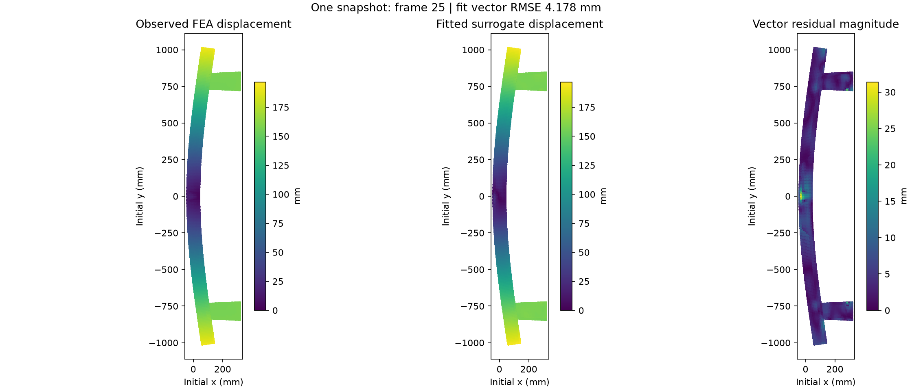
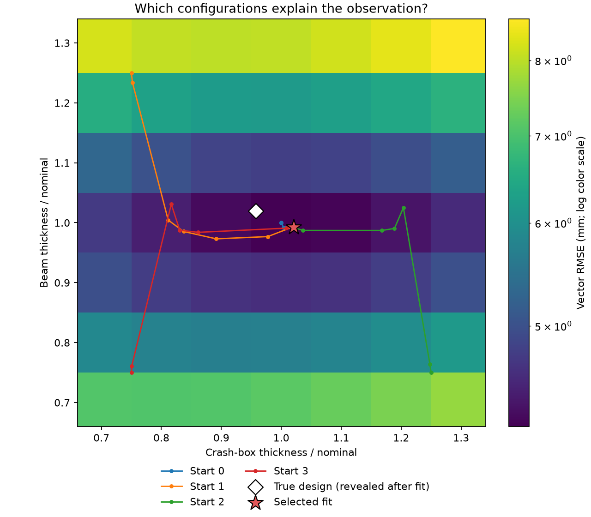
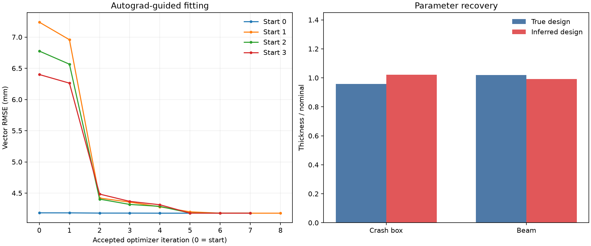

# Recover bumper thicknesses from one displacement snapshot

Exercise 2 asks which design minimizes mass under a displacement limit. Here the
displacement is observed, and we ask which design could have produced it. We hold
impact velocity and wall position fixed, then infer the crash-box and beam thickness
scales by minimizing the mismatch between an FEA snapshot and the surrogate's prediction.

The observation contains a displacement **vector at each observed structural node at
one time**, rather than a single maximum displacement. This provides many measurements
for two unknowns. The optimizer uses automatic derivatives through the same frozen
checkpoint as exercises 1 and 2. There is no neural-network training in this exercise.

## Run

Use the [shared environment](../README.md#shared-environment), which includes SciPy,
PyTorch, and plotting dependencies. Inside that container on an allocated GPU node,
start from `MLExamples/physics_nemo/03_inverse_problems`:

```bash
export RANK=0 WORLD_SIZE=1 LOCAL_RANK=0
export MASTER_ADDR=127.0.0.1 MASTER_PORT=29500
mkdir -p results
set -o pipefail
"$HOME/venvs/physicsnemo-rocm10/bin/python3" -u infer.py --output-dir results/first_run 2>&1 | tee results/first_run.log
```

Omit `2>&1 | tee results/first_run.log` to leave console output only on screen.
Each explicit output directory must be new. Without `--output-dir`, the script makes
a timestamped directory under this exercise's `results/` folder. Relative output
paths are resolved from your launch directory. No activation or `PYTHONPATH` is needed.

The default uses a 7 × 7 grid followed by four bounded L-BFGS-B searches, each with at
most 50 iterations. `--grid-size` and `--maxiter` change those budgets. Optional
`--noise-mm 0.5 --seed 7` adds reproducible Gaussian noise with standard deviation
0.5 mm to each observed vector component. This is measurement noise, distinct from
the coordinate normalization scales used by the network.

## An observation the checkpoint did not train on

The bundled [observation](data/unseen_shortlist_3/observation.json) comes from
`confirm_shortlist/run_3`, an OpenRadioss simulation performed after this checkpoint's
training. Its thickness pair is absent from all 225 configurations in the original
dataset. This was a surrogate-proposed design sent for FEA confirmation, not a randomly
selected test sample. It demonstrates inversion on an unseen configuration, not a
statistical benchmark of generalization.

The earlier `run19` and `run201` cases in exercise 1 were held out from the toy training
set but **were used to train the supplied checkpoint**. They are unsuitable for claiming
unseen-data inversion. The [training manifest](data/checkpoint_training_manifest.json)
records the checkpoint hash, the 220 runs listed in the original training log, training
thickness values, and hashes of the original config/log. The bundled observation is
checked against its own hash and that checkpoint's hash before fitting.

The initial geometry, node correspondence, velocity `-7`, and wall position `0` are
known. The two thickness scales are hidden from the fitting objective and starting
points. They are revealed only after fitting, for parameter-recovery error and a
diagnostic forward prediction at the true design. The fitter uses 13,675 nodes connected
to structural shell elements, excluding auxiliary/contact part 1, while retaining the
complete 13,882-node mesh for model evaluation.

### Which time is used?

We use animation frame A026: the 25th frame after the initial A001 frame. It maps to
zero-based model output index **24**. The model predicts the first 50 future frames;
the datapipe takes the first 51 source frames including the initial state, without
resampling. The observation and prediction must refer to that same frame.

The historical converter labels frame k as `k * 0.005`, so this snapshot has training
label `0.125`. The source VTK records solver time `25.0002` in native solver units.
These are different conventions: the example preserves both and does not claim that
the training label is a physical time in seconds. The network predicts discrete frames;
it does not accept an arbitrary continuous time as input.

To prepare another snapshot from raw FEA animation files, use `prepare_observation.py
--help`. It extracts one frame, node indices, and provenance without loading the model.
The workshop ships the prepared data; participants do not need the raw solver output.
Use `--observation-dir` to fit another prepared observation. Its training exclusion
is unverified unless independently established; geometry and node order must match.

## Reported results

Status: measured 2026-09-30 on one GPU in the `MI355x` partition. The run used the
existing cluster environment (PyTorch 2.9.1 / ROCm 7.2.1, PhysicsNeMo 2.1.1, SciPy
1.18.0), not the later shared ROCm 10 environment. The device reports
`AMD Radeon Graphics`. Numerical artifacts and figures are in
[`reported_results/first_run/`](reported_results/first_run/).

| Quantity | Result | Source in `run.json` |
|---|---:|---|
| True crash-box scale | 0.957143 | `observation.true_design.crash_box` |
| Inferred crash-box scale | 1.020583 | `inferred_design.crash_box` |
| True beam scale | 1.020000 | `observation.true_design.beam` |
| Inferred beam scale | 0.992389 | `inferred_design.beam` |
| Absolute crash-box scale error | 0.063440 | `absolute_parameter_error.crash_box` |
| Absolute beam scale error | 0.027611 | `absolute_parameter_error.beam` |
| Nominal-design vector RMSE | 4.1838 mm | `nominal_vector_rmse_mm` |
| Fitted vector RMSE | 4.1784 mm | `fitted_vector_rmse_mm` |
| Relative field error | 3.4003% | `100 * relative_field_error` |
| Surrogate RMSE at true design | 4.2413 mm | `true_design_surrogate_vector_rmse_mm` |
| Selected optimizer converged | true | `solver_success` |



The fitted field resembles the observation, but its residual is not zero. In this case
the nominal design already fits nearly as well: optimization only reduces RMSE from
4.1838 to 4.1784 mm. The surrogate at the true thicknesses has a slightly larger residual,
so minimizing mismatch does not recover the exact source parameters.



All four starts converge near the same fitted configuration. The low-error region is
broader in crash-box thickness than in beam thickness, illustrating different parameter
sensitivities. This grid is a diagnostic, not a formal identifiability or uncertainty analysis.



### Configuration and provenance

- Observation: FEA confirmation case 3, frame 25 after t0, 13,675 structural nodes.
  Noise is disabled. Velocity and wall position are fixed at -7 and 0.
- Search: 7 × 7 grid, four distinct starts, thickness bounds [0.7, 1.3], maximum
  50 iterations per start. The checkpoint and observation SHA256 hashes, software,
  UTC start time, and stopping outcomes are recorded in [run.json](reported_results/first_run/run.json)
  and [multistart.csv](reported_results/first_run/multistart.csv).
- Launch: `python3 -u infer.py --output-dir results/structural_run`, with the single-process
  variables described above. Selected artifacts were copied into `reported_results/first_run/`.
  The raw console log and exact source commit were not retained alongside this run.
- The fitted configuration has not been independently evaluated with OpenRadioss.
  The observations are real FEA results, but that does not validate the new inferred pair.
- [VALIDATION.md](VALIDATION.md) describes numerical and provenance checks.

## Mathematics

Let x contain the two unknown thickness scales, and let y_i be the observed displacement
vector of node i at the selected frame. With the known load fixed, the surrogate predicts
normalized positions. Convert their difference from initial positions back to millimetres:

$$
x=(x_c,x_b),\qquad u_i(x)=(\hat p_{i,t}(x)-p_{i,0})\odot\sigma_p.
$$

As in exercise 2, sigma_p is the training coordinate scale, not uncertainty. All
three displacement components enter the fit. Define the mean squared vector residual
and observation scale, then solve a bounded least-squares problem:

$$
J(x)=\frac{\frac{1}{N}\sum_{i=1}^{N}\|u_i(x)-y_i\|_2^2}{s_y^2},
\qquad s_y^2=\frac{1}{N}\sum_{i=1}^{N}\|y_i\|_2^2,
\qquad \min_{0.7\leq x_c,x_b\leq1.3} J(x).
$$

Scaling by s_y squared makes the objective dimensionless and does not change its
minimizer. The reported **vector RMSE** is the square root of the mean squared vector
residual, in mm; it averages over nodes, not over 3N separate scalar components.
The relative field error is the norm of the full residual divided by the observation
norm, equal to the square root of J.

Unlike the maximum in exercise 2, this objective does not switch between a controlling
node or frame. Autograd differentiates the squared residual through the model:

$$
\frac{\partial J}{\partial x_j}
=\frac{2}{N s_y^2}\sum_i
\left(u_i(x)-y_i\right)^T\frac{\partial u_i(x)}{\partial x_j}.
$$

The model weights stay frozen; only the two input thicknesses require gradients.
`torch.autograd.grad` supplies the exact derivative of the implemented surrogate
objective to L-BFGS-B, not a derivative of OpenRadioss. The script also compares it
with central differences at nominal thickness, using steps 0.01 and 0.001.

## Search and interpretation

1. Load the snapshot and the existing checkpoint; check geometry, frame mapping, and hashes.
2. Evaluate the displacement mismatch over a coarse thickness grid.
3. Refine from the best grid point, nominal thickness, and two fixed off-diagonal starts.
   If nominal duplicates the grid seed, use `(0.75, 0.75)` as the fourth distinct start.
   None of these choices uses the hidden thickness labels. Stopping tolerances are
   `ftol=1e-8` and `gtol=1e-6`, appropriate to a float32 model objective.
4. Select the smallest objective among final candidates, preferring a converged search
   when objectives differ by at most `1e-8`. Retain the best grid point if it is better
   than the selected local result. Report convergence separately from fit quality.
5. Reveal the true parameters, compare them with the estimate, and evaluate the surrogate
   at the true parameters. Save numerical results and plots before marking the run complete.

A good displacement fit does not guarantee exact parameter recovery or uniqueness.
Different thickness distributions can produce similar responses at one time, and an
optimizer can compensate for surrogate bias by shifting the parameters. Compare the
fit RMSE with the surrogate RMSE at the true design: a lower fit error at different
thicknesses may reflect model discrepancy, not more accurate physics. The grid and
multiple starts reveal some ambiguity but do not provide confidence intervals or prove
global optimality. Additional frames, sensors, or independent loads can help constrain
an ambiguous inverse problem.

The final inferred configuration has not been independently run through FEA. A separate
solver run at that configuration is the next validation step, followed by comparing its
predicted measurements with the observation.

## Results and artifacts

The reporting strategy matches exercises 1 and 2: the script writes a new run under
`results/<run-id>/`; selected artifacts and README figures are published under
`reported_results/<run-id>/`. It does not edit the README automatically.

| File in the output directory | Contents |
|---|---|
| `run.json` | Status, environment, observation provenance, checkpoint hash, inferred parameters, gradient checks, fit and recovery errors |
| `checkpoint_config.yaml` | Resolved checkpoint configuration |
| `grid.csv` | Both thickness scales, normalized objective, and vector RMSE for each grid point |
| `optimization_history.csv` | Accepted iterations for each optimizer start, including its initial point |
| `multistart.csv` | Starting and final parameters, fit error, convergence status and message for each search |
| `snapshot.npz` | Observed and clean FEA displacement, fitted/nominal/true-parameter surrogate fields, coordinates and node indices |
| `displacement_fit.png` | Observed and fitted magnitude with a shared color scale, plus vector residual magnitude |
| `loss_landscape.png` | Grid fit error and search paths, with true and inferred configurations |
| `convergence.png` | Fit error by iteration and true versus recovered parameters |

The field plot uses initial x-y coordinates for display; fitting uses 3D vectors at all
observed nodes. The residual panel has its own scale. The landscape shows the sampled
grid and accepted iterates, not an exhaustive map of all possible solutions.
Temporary reader VTP exports, if produced, also remain inside the run directory.

To regenerate figures from an existing run, without a GPU or model loading:

```bash
"$HOME/venvs/physicsnemo-rocm10/bin/python3" plot_results.py results/first_run
```

### Recording results on another system

Select a single completed run. Check the exit code, `status: complete`, solver status,
and all expected files. Use its `run.json` for fit/recovery metrics and `multistart.csv`
for convergence. Copy its JSON, CSV, YAML, NPZ, PNGs, and console log to
`reported_results/<run-id>/`; embed that run's figures and record the date, command,
hardware, software, frame, noise, and checkpoint/observation hashes. Mark missing
provenance as unrecorded. Do not combine measurements and figures from different runs.

For example, ask an agent:

> Update this README from `results/first_run/`. Verify completion, report the inferred
> thicknesses, parameter errors, field RMSE, relative field error, gradient checks and
> convergence across starts. Copy the selected artifacts into `reported_results/first_run/`,
> embed its three figures, and record configuration and provenance. Explain any discrepancy
> between good displacement fit and parameter recovery; do not claim uniqueness or
> independent FEA confirmation without evidence.
